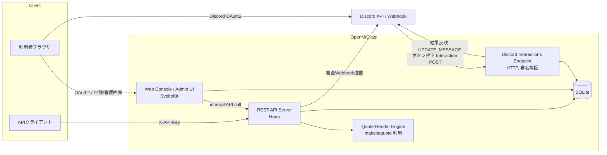
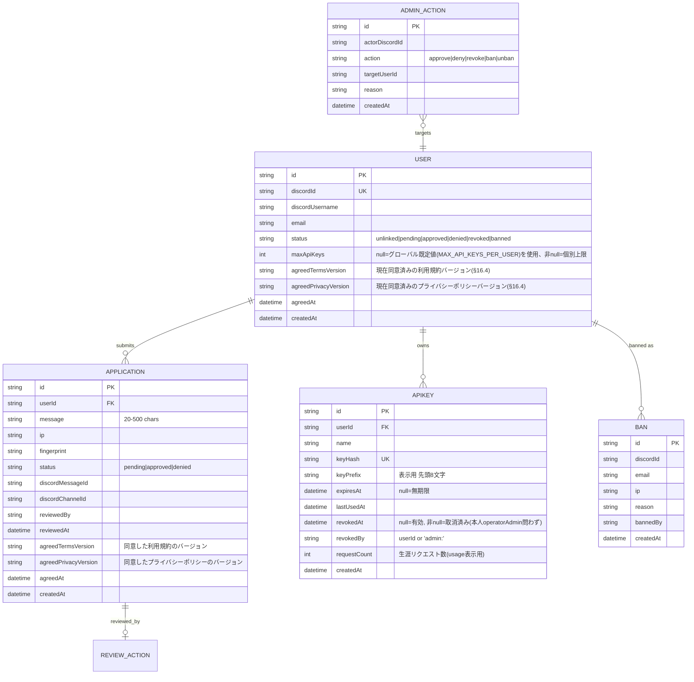
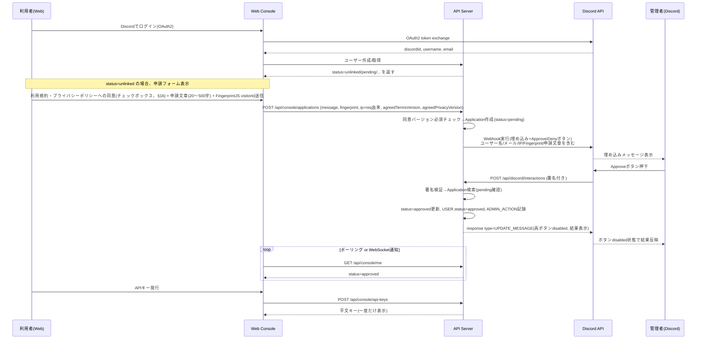

# OpenMiQ-api 設計書

> **本ドキュメントは設計検討中のものであり、今後の実装・議論の進行に応じて内容が変更される可能性があります。**

## 0. 前提・参照元

- 参照元: [github.com/otnc/OpenMiQ](https://github.com/otnc/OpenMiQ)（Discord用 Make it a Quote Bot。画像生成本体は [`makeitaquote`](https://github.com/otnc/makeitaquote) ライブラリ）
- ライセンス: **AGPL-3.0-or-later**（`LICENSE` はそのまま流用）
- 追加条項: **`ADDITIONAL_TERMS.md`（AGPL §7 に基づく追加条項）もそのまま流用**
  - 帰属表示（ソフトウェア名・原著作者名・元リポジトリURL）を README / about・credits 相当の画面・API レスポンスの3箇所に表示する義務あり
  - 改変版であることの明示義務（"OpenMiQ" と同一名称を名乗ってはならない → 本プロジェクト名は **`OpenMiQ-api`** とし、README冒頭で "based on OpenMiQ (https://github.com/otnc/OpenMiQ), with modifications" を明記）
  - 商標非許諾、`.github/assets/` のアイコン・ロゴは無改変利用時のみ使用可（本プロジェクトは著作権者本人の許諾のもと、これらの資産をそのまま `.github/assets/` に同梱する。詳細は §0.1）
  - AGPL §13（ネットワーク利用条項）にも留意: 本プロジェクトはネットワークサービスとして提供するため、Swagger UI・Web管理画面のフッター等に**ソースコード入手先リンク**を常設する

### 実装対応（License/Terms）チェックリスト
- [ ] `LICENSE` を無改変でコピー
- [ ] `ADDITIONAL_TERMS.md` を無改変でコピー
- [ ] `.github/assets/icon.png` / `logo.png` を OpenMiQ から著作権者本人の許諾のもとコピー（§0.1）
- [ ] README冒頭に帰属表示（3要素: ソフトウェア名 / 原著作者 / URL）+ 改変明示文を記載
- [ ] Web UI フッター・Swagger UI の info.description・`GET /api/about` (or `/api/credits`) API に同様の帰属表示を実装
- [ ] `package.json` の `license` を `AGPL-3.0-or-later` に設定

### 0.0 参考: OpenMiQ-misskey（同一著者による先行の派生プロジェクト）

[github.com/otnc/OpenMiQ-misskey](https://github.com/otnc/OpenMiQ-misskey)（Misskey版MiQ Bot、同じく otoneko. 氏の作）を確認したところ、`LICENSE` / `ADDITIONAL_TERMS.md` は **OpenMiQ本家と一字一句同一**（diff差分なし）だった。README側で以下の型が既に確立されている（本プロジェクトもこれに倣う）:

- 冒頭に一文で由来を明記: _"Based on [OpenMiQ](https://github.com/otnc/OpenMiQ) (a Discord bot), with modifications for Misskey — see [Credits](#credits)."_
  → 本プロジェクトでは: _"Based on [OpenMiQ](https://github.com/otnc/OpenMiQ) (a Discord bot), with modifications for a Web API — see [Credits](#credits)."_
- `## What's different from the Discord version` 節を設け、元がDiscord Bot、派生先が別ドメイン（Misskey／本プロジェクトではWeb API）であることの差分を明示している
- `## Author` 節（otoneko. へのリンク）
- `## Credits` 節: OpenMiQ本体・`makeitaquote`ライブラリ・オリジナルのMake it a Quote(Twitter/Discord/Misskey/Bluesky)への言及を列挙
- `## License` 節の定型文（そのまま踏襲する）:
  > This project is licensed under the [GNU Affero General Public License v3.0 or later](./LICENSE), carrying forward the [additional terms](./ADDITIONAL_TERMS.md) OpenMiQ itself is licensed under (AGPL-3.0 Section 7) — preserved here, unmodified, since this bot is a modified version of that software.
  >
  > - **SPDX:** `AGPL-3.0-or-later` (with additional terms under AGPL-3.0 Section 7)
  > - If you distribute or run a modified version of _this_ bot, the same additional terms require you to make your modified source available under AGPL-3.0 and to display attribution to OpenMiQ (original repository URL: https://github.com/otnc/OpenMiQ) as described in [ADDITIONAL_TERMS.md](./ADDITIONAL_TERMS.md).
- badges: CI / License / Additional Terms / Node version をREADME冒頭に並べるスタイル
- `## Configuration` 節: 環境変数を Markdown テーブル（`Variable | Purpose`）で列挙するスタイル → 本設計の §11 もこの形式に統一する
- `## Known vX limitations` 節: 元のDiscord版との機能差・既知の制約を正直に明記するスタイル → 本プロジェクトでも「Botの対話的ボタン編集は無い」「一部コマンドはWeb UIのみ」等の差分をREADMEに明記する

### 0.1 ブランド資産（アイコン・ロゴ）の扱い

`ADDITIONAL_TERMS.md` §4 は本来「`.github/assets/` のアイコン・ロゴは無改変の同一プロジェクトを指す用途以外への流用を禁止」する条項だが、**本プロジェクトの利用者は OpenMiQ 本家のアイコン・ロゴの著作者本人**であるため、著作権者自身の許諾により OpenMiQ本家・OpenMiQ-misskey と同様に、これらの資産を **`.github/assets/icon.png` / `logo.png` としてそのままリポジトリにコミットしてよい**。

- `apps/web` の静的アセット（favicon・ヘッダーロゴ等）は既定でこの `.github/assets/` の画像を参照する。
- ただし本人以外がセルフホストしてブランディングを変えたい場合のために、`ICON_PATH` / `LOGO_PATH` 環境変数（§11）で差し替え可能にしておく。未設定時は `.github/assets/icon.png` / `logo.png`（＝OpenMiQ本家の資産）にフォールバックする。
- README/`.env.example` のコメントには、これらの資産は著作権者本人の許諾のもと同梱されている旨、および `ADDITIONAL_TERMS.md` §4 により**このアイコン・ロゴを別のブランド・別の名称のプロジェクトの独自ブランディングとして転用することはできない**旨を明記する（＝そのまま使う／`ICON_PATH`・`LOGO_PATH`で自分の画像に差し替えるかのいずれかであり、OpenMiQ本家の資産に手を加えて別ブランドとして名乗ることは許されない）。

---

## 1. 概要

OpenMiQ のクォート画像生成機能を、Discord Bot からではなく **Web API（REST）** として第三者に提供するサービス。

- 利用者は API Console（Web）で Discord 連携し、申請文章を提出
- 管理者が Discord Webhook 上の埋め込み + Approve/Deny ボタンで審査
- 承認されたアカウントのみ API Key を発行・管理でき、Swagger UI から動作確認しつつ本番利用できる
- 管理者は Web 管理画面からいつでもアクセス取り消し・BAN・拒否ユーザー管理が可能

---

## 2. 全体アーキテクチャ



**設計上の要点**:
- Discordとのボタン連携は **Gateway Bot（常駐接続）ではなく Discord の HTTP Interactions Endpoint** を採用する。
  - Discord Developer Portal でアプリケーションに「Interactions Endpoint URL」を1つ登録すると、ボタン押下は毎回 HTTPS POST として飛んでくる（Ed25519署名付き）。
  - 判定に必要な状態は全てDBに保持し、プロセス内メモリに一切依存しないため、**サーバー再起動後もボタンは常に有効**（「再起動後にも読み込み、いつでも押せる」という要件を自然に満たす）。
  - Webhook自体はボタン付き埋め込みの「送信」にのみ使う（`POST /webhooks/{id}/{token}` は components 付きメッセージ送信に対応）。押下時の応答は Webhook ではなく上記 Interactions Endpoint が受ける。

---

## 3. 技術スタック

> 依存ライブラリの網羅的な一覧・用途・選定理由は [`docs/LIBRARIES.md`](./LIBRARIES.md) を参照。ここでは代表的なレイヤごとの選定のみ扱う。

セルフホスト前提（VPS 1台等）で運用することを最優先し、**実行時フットプリントが軽く、依存が少ないもの**を基準に選定した。あわせて「一般的（＝コミュニティで実績が多く、情報が探しやすい）」構成に寄せている。

### 3.1 選定理由（比較を含む）

| レイヤ | 選定 | 検討した代替 | 選定理由 |
|---|---|---|---|
| 言語 | TypeScript（**5系ではなく6系**、`^6.0.3`） | — | OpenMiQ 本家・姉妹npmパッケージ群と統一。`packages/openmiq`（§15）のESM/CJS両対応 + `.d.mts`/`.d.cts` 分離出力に必要な機能を含む最新系列に揃える（§13.3） |
| APIフレームワーク | **Hono** (`@hono/node-server`で実行) | Fastify, Express | 指定どおり。ミドルウェアが最小構成で軽量、Node/Bun/Deno等マルチランタイム対応で将来Bun移行も容易。`@hono/zod-openapi` でルート定義から型安全にOpenAPIを自動生成できるのが決め手 |
| バリデーション/スキーマ | **Zod** | Valibot | `@hono/zod-openapi` が前提とする組合せで、コミュニティ事例が最も多い |
| API docs / Swagger UI | **`@hono/zod-openapi` + `@hono/swagger-ui`** | swagger-jsdoc手動記述 | ルート定義（Zodスキーマ）から自動でOpenAPI 3.1を生成でき、手書きSwaggerとのズレが発生しない |
| ORM / DB | **Drizzle ORM + SQLite**（`better-sqlite3`、決定） | PostgreSQL, Prisma | セルフホスト規模・運用コストを優先しSQLiteに決定（本家のローカルファイルストア思想にも近い）。複数インスタンス運用が必要になった場合のみPostgreSQLへの切替を検討する。Prismaはクエリエンジンのネイティブバイナリを同梱し自己ホストにはやや重いため不採用 |
| Web UI (Console/Admin) | **SvelteKit**（`adapter-node`でセルフホスト） | Astro, Next.js | Next.jsは指定により除外。Astroは静的コンテンツ+部分的な島構造向きで、認証必須の動的ダッシュボード（フォーム送信・ポーリング更新・権限分岐）には不向き。SvelteKitはビルド後のクライアントJSが小さく、SSR/APIルート（`+server.ts`）を1アプリで完結でき、セルフホスト実績も豊富 |
| UIコンポーネント | **shadcn-svelte**（導入済み。`bits-ui` + `tailwind-variants`ベース、style: `nova`, baseColor: `neutral`） | Skeleton UI, DaisyUI | 指定の shadcn/ui 系列で、SvelteKit向け公式相当の移植として最も知名度・実績がある。CLIの`init`が対話式のプリセット選択（ブラウザでの生成が前提）を要求しノンインタラクティブ環境で自動化できなかったため、CLIバンドルから実際のデフォルト`components.json`スキーマとテーマCSS変数を確認した上で手動で用意し、`add`コマンドで個々のコンポーネントを取得する方式に切り替えた（詳細はdocs/LIBRARIES.md） |
| Discord OAuth2 | **`@badgateway/oauth2-client`（決定・再変更）** | Arctic, 自前実装(ofetchベース), openid-client | 当初Arcticを予定していたが実装着手時点でnpm上**deprecated**と判明し、一時的に自前ofetch実装へ切替えていた。ただし認可コードフローの状態検証・PKCE・トークン交換を毎回手書きするのは車輪の再発明であり保守負荷も残るため、改めて汎用OAuth2クライアントライブラリに戻す。`openid-client`はOIDC専業でDiscordのような素のOAuth2プロバイダには discovery document 前提の設計がやや過剰。`@badgateway/oauth2-client`はOIDCに限定しない汎用OAuth2クライアントで、依存ゼロ・4KB gzip・`fetch()`ベース、authorization_code+PKCEをビルトインサポートしメンテナンスも活発（2026年時点でリポジトリへの直近pushあり、npm非deprecated）。PKCEの`codeVerifier`とCSRF対策の`state`（`ransu/secure`の`token()`で生成）はいずれもhttpOnly Cookieに一時保存して照合する。Discordの認可エンドポイント(`https://discord.com/oauth2/authorize`)とトークンエンドポイント(`https://discord.com/api/oauth2/token`)は`/api`プレフィックスの有無が異なる点に注意 |
| Discord Webhook送信・メッセージ編集 | **`ofetch` によるREST API直叩き（決定・再検討済み）** | discord.js, `@discordjs/rest` | Botとして常駐する必要がなく、Webhook実行(`POST /webhooks/{id}/{token}`)とメッセージ編集(`PATCH`)のみで完結するため、discord.js（Gateway前提の重量級ライブラリ）は不要。`@makeitaquote/utils`（§15）が既に依存している`ofetch`を採用し素の`fetch`から置き換え——リトライ・タイムアウト・エラーハンドリングを自前実装せず済む。`@discordjs/rest`（レート制限バケット管理込み）とも比較したが、本サービスの呼び出し頻度（申請1件につきWebhook送信1回、承認/却下1回につきメッセージ編集1回という低頻度・非バースト）では429を受けてから`Retry-After`に従い1回リトライする程度で十分であり、常時バケット管理を行う専用RESTマネージャーは過剰と判断。詳細は§6.4 |
| Discord Interactions署名検証 | **`discord-interactions`**（公式提供の軽量パッケージ） | 自前Ed25519検証 | Discord公式（`discord/discord-interactions-js`）が保有・メンテナンスするパッケージ。npm上の最終更新は約1年前に見えるが、GitHubリポジトリ自体はアーカイブされておらず直近まで更新・リリースがあり、署名検証という仕様が安定した領域のため更新頻度が低いだけで放棄されたパッケージではないと判断した。公式実装を使い、検証ロジックの実装ミスを避ける |
| セッション | **JWT（`hono/jwt`）を httpOnly Cookie に格納、DBセッションテーブルは持たない** | Lucia, DBセッション管理 | Luciaは作者が非推奨化しライブラリとしての継続性に懸念。本設計では保護ルートで毎回 `USER.status` をDBから再取得して判定するため（BAN即時反映のため元々必須）、JWT自体をstatelessにしても実害がなく、セッションテーブルを持たない分シンプルになる |
| APIキー用ハッシュ | **`node:crypto` の SHA-256**（標準モジュールのみ） | argon2, bcrypt | APIキーは十分なエントロピーを持つランダム文字列であり、低エントロピーな人間のパスワード向け設計のargon2/bcryptは過剰かつネイティブアドオンのビルドが自己ホストの障害になりやすい。GitHub Personal Access Token等と同様の一般的な方式。ハッシュ化そのもの（一方向変換）は`ransu`の対象外（下記参照）なので`node:crypto`のまま維持する |
| ID生成・乱数（APIキー本体・トークン・DB主キー） | **`ransu`**（DB主キーは`uuid.v7()`、秘匿トークンは`ransu/secure`の`token()`）（決定・置き換え） | `node:crypto`（`randomUUID`/`randomBytes`直書き）, `uuid.v4()` | `@makeitaquote/utils`と同じ著者(otoneko.)によるゼロ依存の乱数/ID生成ライブラリ。**DB主キーをv4ではなくv7にする理由**: v4は完全ランダムなためSQLite/多くのRDBMSのB-tree主キーインデックスへ挿入するたびランダムな位置に書き込みが発生し、ページ分割やインデックス断片化を招く。v7はミリ秒単位タイムスタンプ+ランダム値の構成で挿入順とほぼ一致するため、追記型インデックスとして局所性が保たれ、SQLite単一ファイルでのI/O効率でも有利になる。UUID自体のランダム性・衝突耐性はv4と同等（122ビット相当のランダム部分）なので、セキュリティ上のトレードオフは無い。APIキー本体・セッション等の秘匿トークンはUUIDではなく`ransu/secure`の`token()`（プラットフォームCSPRNGベース、シード不可＝予測不能性が保証される専用エントリポイント）を用いる。`node:crypto.randomUUID`/`randomBytes`の直接呼び出しを置き換え、用途（一般乱数 vs 秘匿トークン）を型・インポートパスで強制できるのが利点 |
| レート制限 | **`hono-rate-limiter` + 自前のSQLite永続カウンタストア（決定）** | インメモリのみ, Redis | 「ローカルで管理しつつ再起動後もカウントを維持したい」という要件のため、既にDBとして採用しているSQLiteに`rate_limit_counters`テーブルを持たせて永続化する。外部ミドルウェア(Redis等)を追加せずに済み、単一プロセス自己ホストの前提とも合う（詳細§5.4） |
| 画像生成 | `makeitaquote`（本家依存を継承） | 再実装 | ロジック再実装を避け、本家との互換性を保つ |
| 画像ストレージ（hosted URLモード） | **Cloudflare R2（既定・決定）** + ローカルディスク（`ImageStore`実装として用意はするが既定では使わない） | AWS S3, Backblaze B2, Cloudinary, Supabase Storage | 「無料で制限が緩いもの」という基準で比較: R2は無料枠が10GB/月のストレージと大きく、**エグレス（送信）課金が無い**のが画像配信用途で決定的に有利（S3・B2はストレージは安いがエグレス課金がある）。セルフホストである以上ローカル保存も選択肢として残すが、大量の画像を扱う前提であればディスク容量の限界に達しやすいため、**Cloudflare前提で運用する**方針とする（詳細§8.6） |
| R2（S3互換）へのアクセス | **`aws4fetch`**（決定） | `@aws-sdk/client-s3` | `@aws-sdk/client-s3`はAWS SDK v3のフル依存ツリー（多数のサブパッケージ）を引き込み自己ホストには重い。`aws4fetch`はゼロ依存・数十KBでSigV4署名とfetchベースのリクエストのみを提供する軽量ライブラリで、R2のようなS3互換APIへのPUT/GET/DELETEには十分。プロジェクト全体の「軽量なものを選ぶ」方針とも合致する |
| モノレポ管理 | **Turborepo** | Nx, 素のpnpmスクリプトのみ | pnpmワークスペースにタスクの依存関係解決・キャッシュを追加する薄いツール。Nxよりインストールサイズ・学習コストが小さく、pnpmモノレポでの採用事例が最も一般的 |
| i18n（Web UI） | **自前の`Translations`オブジェクト**（OpenMiQ本家 `src/i18n/index.ts` と同じ手法、外部ライブラリ非依存） | svelte-i18n, Paraglide JS | 対応言語がEN/JAの2つのみで、OpenMiQ/OpenMiQ-misskey本家が採用している「コードにコロケートしたTranslationsオブジェクト」を流用すれば十分薄く、依存も増えない。本家との開発体験の一貫性も優先（詳細§17） |
| フィンガープリント | FingerprintJS OSS版（クライアント側） | — | サーバーへ`visitorId`を送信し保存するのみ |
| プロセス管理 | pm2（本家 `ecosystem.config.cjs` を踏襲） | systemd, Docker | 本家との運用手順の一貫性を優先。Dockerでの提供も別途検討可 |

### 3.2 モノレポ内のランタイム構成
- `apps/api`: Hono + `@hono/node-server`（Node.js `>=24`、本家と合わせる。将来的にBun実行への切替も構成上可能）
- `apps/web`: SvelteKit + `adapter-node`
- 両者は別プロセス・別ポートで自己ホストし、nginxでパスルーティング（`/api/*` → apps/api、それ以外 `/` → apps/web）する構成。詳細は §14

---

## 4. データモデル



### 補足
- `USER.status`:
  - `unlinked` → Discord連携前(実質レコードなし)
  - `pending` → 申請文章提出済み・審査待ち。**この間は新規申請を`409`で拒否**（多重pending禁止、§6.5）
  - `approved` → 承認済み(=API Console利用可、APIキー発行可)
  - `denied` → 却下。**決定: `REAPPLY_COOLDOWN_DAYS`（環境変数、日単位、§11）経過後に再申請可能**（起点は最新の`denied`Applicationの`reviewedAt`）。それ以前の再申請はエラーで却下し、あと何日で再申請可能かを返す（§6.6）
  - `revoked` → 一度承認したが管理者がアクセス取り消し(APIキー全失効)。**決定: `denied`と同じ`REAPPLY_COOLDOWN_DAYS`ルールで再申請可能**（起点は`ADMIN_ACTION`の該当`revoke`アクションの`createdAt`、§6.6。以前の「再申請不可」から変更）
  - `banned` → BAN(ログイン自体をブロック。クールダウンの有無に関わらず永久に再申請不可)
- `BAN` は退会/削除されたユーザーの痕跡も残せるよう `USER` に対するFKではなく `discordId/email/ip` を直接保持（拒否ユーザーをBANしても該当ユーザーがアカウント作り直せないようにするため）。BANは`denied`/`revoked`の再申請クールダウンより優先し、`BAN`テーブルに一致するdiscordId/email/ipへの申請は理由に関わらず即拒否する。
- `APPLICATION.agreedTermsVersion`/`agreedPrivacyVersion`/`agreedAt`: 申請提出時点で同意した利用規約・プライバシーポリシーのバージョンを記録する（§16）。同意なしでは`POST /api/console/applications`を受け付けない。
- APIキーは平文を保存しない。発行時に一度だけ平文を表示し、以降は `keyHash`（SHA-256、§3.1参照）と `keyPrefix`（一覧表示用）のみ保持。
- **1ユーザーにつき複数のAPIキーを作成可能**。ただし**上限を設ける（決定）**: 既定は環境変数`MAX_API_KEYS_PER_USER`（§11）によるグローバル上限、`USER.maxApiKeys`が設定されていればユーザー個別にそれを優先する（管理画面から個別上書き可能）。作成時に有効なキー数（`revokedAt IS NULL`）が上限に達していれば`409`で拒否する。
- **有効期限は作成時に自由に設定可能**（`expiresAt = null` で無期限）。認証ミドルウェアで `expiresAt` が過去の場合は無効として扱う。
- **再発行（regenerate）**: 同じレコード（`id`/`name`/`expiresAt`は保持）の `keyHash`/`keyPrefix` のみを新しいシークレットで置き換える。旧シークレットは即座に失効。
- **削除**: 本人がいつでもキーを完全削除可能。**個別削除と一斉削除の両方を用意（決定）**: `DELETE /api/console/api-keys/:id`（個別）と `DELETE /api/console/api-keys`（自分の全キーを一括削除）。管理者側も同様に `DELETE /api/admin/api-keys/:id`（個別）と `DELETE /api/admin/api-keys?userId=`（指定ユーザーの全キーを一括削除）を用意する。
- **管理者による取り消し**: `revokedAt`/`revokedBy` を設定するソフト取消と、`admin`権限での完全削除の両方をサポートし、管理画面のAPIキー一覧からユーザーを問わずどのキーでも即時無効化できる。

---

## 5. 認証・認可設計

### 5.1 Web Console（利用者）
1. `GET /api/auth/discord` → Discord OAuth2 (`identify email`) にリダイレクト
2. コールバックで `discordId / username / email` を取得し `USER` を作成 or 取得
3. セッションJWTをhttpOnly Cookieに設定（有効期限つき、リフレッシュはDiscordトークンで再検証 or 再ログイン）
4. `USER.status` に応じて画面遷移:
   - レコードなし/`unlinked` → 申請フォームへ
   - `pending` → 「審査中」画面
   - `approved` → API Console（キー発行・利用状況）
   - `denied` / `revoked` / `banned` → 該当ステータス画面（再申請可否は管理設定に従う）

### 5.2 管理画面（Admin）
- Discord OAuth2ログインは共通。ただし `ADMIN_DISCORD_IDS`（環境変数）または指定Discordギルドの特定ロール保持者のみ `/api/admin` 配下にアクセス可（サーバー側でロールをDiscord APIから検証）。

### 5.3 API利用者
- `X-API-Key: <plaintext>` ヘッダを受け取り、`sha256/argon2` でハッシュ化して照合
- キー単位で `revokedAt IS NULL` かつ紐づく `USER.status = approved` であることを確認（Userが後からrevoke/banされてもキーは即座に無効化される設計＝キー側にもrevokedAtがあるが、User状態を都度チェックすることで「アクセス取り消し」が即時反映される）
- レート制限は `hono-rate-limiter` でAPIキー単位のバケットを設定
- APIキー認証時に `expiresAt` の期限切れ・`revokedAt` の設定有無をあわせて検証する
- **同意バージョンチェック（決定）**: `USER.agreedTermsVersion === TERMS_VERSION && USER.agreedPrivacyVersion === PRIVACY_VERSION` を満たさない場合、`USER.status`が`approved`でもAPIキー認証は`403`（`error: "reconsent_required"`）で拒否する。これは`status`を変更しない**一時凍結**であり、再申請は不要——ユーザーがConsoleで再同意すれば即座に解除される（詳細§16.4）

### 5.4 レート制限の可視化（`/usage`）

「今どれくらい使っていて、いつ回復するか」をAPI・Web Console・管理画面のいずれからも確認できるようにする。

- **カウンタストア（決定）**: `hono-rate-limiter` の既定ストアは「消費（インクリメント）」前提のインターフェースで読み取り専用の参照ができないため、`{ get(key): {count, resetAt} | undefined, increment(key): {count, resetAt} }` を満たす**自前の固定ウィンドウストアをSQLite上のテーブル（`rate_limit_counters(key, window_start, count)`）として実装**し、レート制限ミドルウェアと使用状況APIの両方から共有する。「ローカルで管理しつつ再起動をまたいでもカウントが維持される」という要件を、外部ミドルウェア(Redis等)を増やさずSQLite（既に採用しているDB）だけで満たす。書き込み頻度が高いため`PRAGMA journal_mode=WAL`を有効化し、ウィンドウ経過後の古い行は定期的にDELETEするクリーンアップジョブを設ける。複数インスタンス運用が必要になった場合は同インターフェースをRedis実装に差し替える。
- **レスポンスヘッダ**: 全APIキー認証エンドポイントの応答に標準的な `RateLimit-Limit` / `RateLimit-Remaining` / `RateLimit-Reset`（IETF `draft-ietf-httpapi-ratelimit-headers` 準拠の命名）を付与する。
- **専用エンドポイント**: `GET /api/usage`（APIキー認証）で、消費を発生させずに現在のウィンドウの使用状況と、キーの生涯リクエスト数・最終利用日時を返す。
- **Web Console / 発行画面**: APIキー一覧・発行直後の画面に、そのキーの `limit / remaining / resetAt` と累計リクエスト数をインラインで表示する（§8.2）。
- **管理画面**: ユーザー横断のAPIキー一覧・個別ユーザー詳細画面で同様の使用状況を表示できるようにする（§7, §8.3）。

---

## 6. 承認フロー詳細設計



### 6.1 埋め込み内容（Discord Webhook送信）
- タイトル: 「新規APIコンソール利用申請」
- フィールド:
  - Discordユーザー: `username (id: discordId)` (メンションは通知過多になるため文字列表記、必要ならメンションも追加可)
  - メールアドレス
  - IPアドレス
  - Fingerprint (visitorId)
  - 申請文章（コードブロックで表示、500字まで）
  - 申請日時
- コンポーネント: `Approve`(Success, custom_id=`app_approve:<applicationId>`) / `Deny`(Danger, custom_id=`app_deny:<applicationId>`)

### 6.2 Interactions Endpoint 実装要点 (`POST /api/discord/interactions`)
- リクエストヘッダ `X-Signature-Ed25519` / `X-Signature-Timestamp` を `discord-interactions` の `verifyKey` で検証（**Honoでは `c.req.text()` で生ボディを取得できるため、JSONパース前にこの文字列で署名検証を行う**）
- `PING`(type1) には即 `PONG`(type1) を返す（Discordの疎通確認）
- `MESSAGE_COMPONENT`(type3) で `custom_id` を `":"` で分割し `action / applicationId` を取得
- 押下者がAdmin権限を持つか検証（`ADMIN_DISCORD_IDS` or ギルドロール）。権限がなければ `type4` の ephemeralメッセージで「権限がありません」を返し、Applicationは変更しない
- DBトランザクションで `UPDATE application SET status=? WHERE id=? AND status='pending'` を実行し、影響行数0なら「既に処理済み」として現在の状態でボタンをdisabledのまま返す（多重クリック対策）
- 成功時はDiscordの3秒応答制限内に収めるため、まず `type: 6 (DEFERRED_UPDATE_MESSAGE)` を即座に返す。メッセージ本体の更新（`components`をdisabled状態のボタン配列に差し替え、embedのfooterに「Approved by {admin} at {time}」等を追記）は、この応答を返した**後**に同じWebhook（`PATCH /webhooks/{id}/{token}/messages/{message_id}`）で非同期に行う（実装時の決定・変更: 当初案の同期的な`type: 7`一発応答は、Webhook側の429リトライ待ちが3秒を超えるリスクがあるため採用しなかった）。Web管理画面からのApprove/Deny（§7）も同じ関数を通るため、同一のPATCH経路でメッセージが更新される

### 6.3 再起動後もボタンが有効である根拠
- 上記の通り状態は全てDB管理、Interactions EndpointはステートレスなHTTP POSTハンドラであるため、プロセス再起動・複数インスタンス展開のいずれでも常に最新状態から判定・応答できる（本家Botの「再生成ボタンはメモリ依存で再起動後は無効」という制約とは異なる設計）。

### 6.4 Discord REST呼び出しの実装方針（`ofetch` + レート制限対応）

`discordWebhookService.ts` は `ofetch` で以下の2種類のリクエストのみを行う薄いラッパーとして実装する:

- `POST https://discord.com/api/v10/webhooks/{id}/{token}?wait=true` — 審査埋め込み(§6.1)の新規送信
- `PATCH https://discord.com/api/v10/webhooks/{id}/{token}/messages/{message_id}` — Approve/Deny後のボタンdisabled化（§6.2）

**レート制限対応**: Discord APIは429時に `Retry-After`（秒）と`X-RateLimit-*`系ヘッダーを返す。`ofetch`の`onResponseError`フックで429を検知し、`Retry-After`分待って**最大2回まで**自動リトライする薄いミドルウェアを`discordWebhookService.ts`内に実装する（`ofetch`の`retry`/`retryDelay`オプションを429用にカスタマイズ）。グローバルなバケット管理までは行わない — 前述の通り本サービスの呼び出し頻度ではオーバースペックであり、`@discordjs/rest`のような専用RESTマネージャーは導入しない。呼び出し頻度が将来的に増える（例: 複数ギルド・複数Webhook運用など）場合は、この判断を再検討し`@discordjs/rest`への切替を検討する。

### 6.5 申請の悪用防止（スパム対策）

- **Webhook URLの非露出**: `DISCORD_REVIEW_WEBHOOK_URL`はサーバー内部（`discordWebhookService.ts`）でのみ参照し、クライアント（Web UI・APIレスポンス・ログ）には一切含めない。フロントエンドは`POST /api/console/applications`を叩くだけで、Discord Webhookの存在自体を意識しない設計にする。
- **同時に1件までの`pending`制限（決定）**: あるユーザーに`status=pending`のApplicationが既に存在する間は、`POST /api/console/applications`を`409 Conflict`で拒否する（「審査中のため新規申請不可」）。§16のクールダウン判定（`denied`/`revoked`後の再申請待機、§6.6）とは別に、まずこの重複pendingチェックを先に行う。
- **申請エンドポイントのレート制限**: `POST /api/console/applications`はAPIキー認証ではなくセッション/IPベースのため、`hono-rate-limiter`をセッションのuserId（未ログイン時はIP）単位に適用し、短時間の連続送信（アカウント作り直し含む）によるWebhookスパムを防ぐ。
- 上記いずれの制限に該当する場合も、Discordへのwebhook送信自体を発生させない（DBへの書き込み前にガードする）ため、悪用時にAdminのDiscordチャンネルへ大量の埋め込みが届くことを防止する。

### 6.6 再申請ポリシー（`denied` / `revoked` 共通、決定）

- **`denied`・`revoked`のどちらも一定期間後に再申請可能**（`REAPPLY_COOLDOWN_DAYS`、§11）。従来「`revoked`は再申請不可」としていたが、`denied`と同じクールダウン方式に統一する。
- 起点となる日時は新たな列を増やさず既存データから算出する: `denied`は最新の`APPLICATION.reviewedAt`（該当ユーザーの直近の却下）、`revoked`は`ADMIN_ACTION`テーブルの `action='revoke' AND targetUserId=<userId>` のうち最新の`createdAt`を用いる。
- `banned`のみクールダウンの対象外で、永久に再申請不可（§4補足）。

---

## 7. 管理画面（Admin UI）設計

**画面構成（決定）**: Web ConsoleとAdmin UIは**同一SvelteKitアプリ内でページ（ルート）を分離**する。`apps/web/src/routes/(console)/...` と `apps/web/src/routes/(admin)/...` の2つのルートグループとし、`(admin)`配下は共通の`+layout.server.ts`でAdmin判定（§5.2）を行い、権限が無ければリダイレクトする。ナビゲーション・レイアウトも別に持たせ、一般利用者がAdmin機能の存在を意識しないUIにする（別アプリ・別デプロイには分けない＝ドメイン・プロセスは共通のまま、あくまでページ単位の分離）。

| 画面 | 機能 |
|---|---|
| 審査中一覧 | pending の Application 一覧（Web上からもApprove/Deny可能。Discord上での操作と同期） |
| 承認済みユーザー一覧 | `approved` ユーザー一覧。各行に「アクセス取り消し(revoke)」「BAN」ボタン、紐づくAPIキー数・最終利用日時表示、`USER.maxApiKeys`個別上書き設定。`agreedTermsVersion`/`agreedPrivacyVersion`が現行バージョンと不一致のユーザーには「同意待ち(reconsent pending)」バッジを表示（§16.4） |
| 拒否ユーザー一覧 | `denied` ユーザー一覧。「BAN」ボタンで `BAN` テーブルへ追加(以後同一discordId/emailでの再申請をブロック) |
| BANリスト | 全BANエントリ一覧、理由、解除(unban)機能 |
| APIキー管理 | 全ユーザー横断のAPIキー一覧、個別失効。各キーの現在のレート制限使用状況(limit/remaining/resetAt)・生涯リクエスト数・最終利用日時を表示（§5.4） |
| 監査ログ | `ADMIN_ACTION` の一覧（誰が・いつ・何を） |

- Web上のApprove/DenyとDiscord上のApprove/Denyは同一のサービス関数を呼ぶことで、どちらから操作してもDiscordメッセージのボタンが追従してdisabledになるよう、Web操作時もDiscord REST APIでメッセージ編集を行う（`discordMessageId/discordChannelId` をApplicationに保持している理由）。

---

## 8. REST API 仕様（概要）

Swagger UI: `GET /api/docs`（`@hono/swagger-ui`、`@hono/zod-openapi` が生成する OpenAPI 3.1 定義を `/api/docs/openapi.json` でも公開）

### 8.1 公開情報
- `GET /api/about` — 帰属表示（ソフトウェア名/著作者/リポジトリURL）、バージョン、ソース入手先（AGPL §13対応）
- `GET /api/branding/icon`, `GET /api/branding/logo` — `ICON_PATH`/`LOGO_PATH`（§0.1, §11）が指すローカル画像を配信。未設定時は `.github/assets/icon.png` / `logo.png`（OpenMiQ本家の資産、コミット済み）にフォールバック。Web UIはこれをそのまま `` に埋め込む
- `GET /api/legal/terms`, `GET /api/legal/privacy` — 現行バージョンの利用規約・プライバシーポリシー本文をEN/JA両方（`?lang=ja`等）で返す（§16）。Web UI（`/legal/terms`, `/legal/privacy`ページ、§17のi18nでUI言語と連動）はこれを表示する

### 8.2 Console API（セッションJWT必須）
- `GET /api/console/me` — 自分のステータス取得
- `POST /api/console/applications` — 申請提出（`message: string(20..500)`, `fingerprint: string`, `agreedTermsVersion: string`, `agreedPrivacyVersion: string`。現行の`TERMS_VERSION`/`PRIVACY_VERSION`と一致しないと400。既存の`pending`があれば409、`denied`/`revoked`のクールダウン未経過なら429または409＋残り日数。§16, §6.5, §6.6）
- `GET /api/console/api-keys` — 自分のAPIキー一覧（プレフィックスのみ表示、複数件。各要素に `limit/remaining/resetAt/requestCount/lastUsedAt` を含む、§5.4）
- `POST /api/console/api-keys` — APIキー発行（`approved`のみ、`{ name: string, expiresAt: string|null }`、平文は生成時1回のみ返却。有効なキー数が上限（`MAX_API_KEYS_PER_USER`または`USER.maxApiKeys`、§4補足）に達していれば409）
- `PATCH /api/console/api-keys/:id` — 名前・有効期限の変更
- `POST /api/console/api-keys/:id/regenerate` — シークレットの再発行（`id`/`name`/`expiresAt`は保持、旧シークレットは即失効、新しい平文を1回のみ返却）
- `DELETE /api/console/api-keys/:id` — 自分のAPIキーを個別に完全削除
- `DELETE /api/console/api-keys` — 自分のAPIキーを**一斉削除**（決定）
- `GET /api/console/api-keys/:id/usage` — 単一キーの使用状況（消費なしで参照のみ、§5.4）
- `POST /api/console/consent` — 利用規約・プライバシーポリシーへの（再）同意（`{ agree: boolean, termsVersion: string, privacyVersion: string }`）。`agree: true`かつバージョンが現行の`TERMS_VERSION`/`PRIVACY_VERSION`と一致すれば`USER.agreedTermsVersion`/`agreedPrivacyVersion`/`agreedAt`を更新しAPIキー凍結を解除。`agree: false`（明示的な非同意）の場合は何も更新せず凍結状態を維持（§16.4）

### 8.3 Admin API（Admin権限必須）
- `GET /api/admin/applications?status=pending`
- `POST /api/admin/applications/:id/approve`
- `POST /api/admin/applications/:id/deny`
- `GET /api/admin/users?status=approved|denied`
- `POST /api/admin/users/:id/revoke`
- `POST /api/admin/users/:id/ban` (`reason: string`)
- `POST /api/admin/bans/:id/unban`
- `PATCH /api/admin/users/:id` — `maxApiKeys`の個別上書き設定（§4補足）
- `GET /api/admin/api-keys?userId=` — 全ユーザー横断のAPIキー一覧（使用状況を含む、§5.4）
- `GET /api/admin/api-keys/:id/usage` — 単一キーの使用状況
- `POST /api/admin/api-keys/:id/revoke` — ソフト取消（`revokedAt`/`revokedBy`を設定、以後認証不可）
- `DELETE /api/admin/api-keys/:id` — 個別に完全削除
- `DELETE /api/admin/api-keys?userId=` — 指定ユーザーのAPIキーを**一斉削除**（決定）
- `GET /api/admin/audit-log`

### 8.4 Discord連携
- `POST /api/discord/interactions` — Discord Interactions Endpoint（署名検証必須、公開だが実質Discordのみ叩ける）

### 8.5 本体機能（クォート画像生成、APIキー必須）
- `POST /api/quote` — クォート画像生成
  - body例: `{ "authorName": "...", "authorAvatarUrl": "...", "text": "...", "theme": "sunset", "font": "pop", "options": { "color": true, "bold": false, "layout": "new", "hosted": false } }`
  - **応答形式（決定）**: 既定 (`hosted: false` または未指定) は **`image/png` バイナリを1リクエストで直接返す**（`@makeitaquote/voids`の`/fakequotebeta`同様、ラウンドトリップ最小・何も保存しない方針）。`hosted: true` を指定した場合のみ、生成画像をサーバー側の一時ストレージ（`SAVE_IMAGES_DIR`相当、一定時間後に自動削除）に保存し `{ "url": "https://miq.otnc.dev/api/images/:id" }` をJSONで返す。`@makeitaquote/openmiq`（§15）の `toBuffer()`/`toURL()` はこの2パスにそれぞれ対応する
  - 応答ヘッダに `RateLimit-Limit` / `RateLimit-Remaining` / `RateLimit-Reset` を付与（§5.4）
- `POST /api/fakequote` — 任意の名義でのクォート画像生成（本家の`/fakequote`相当、"(fake)"表記オプション対応。応答形式は`/api/quote`と同様）
- `GET /api/images/:id` — `hosted: true`で生成された画像の取得（有効期限切れ後は404）
- `GET /api/usage` — APIキー自身の現在のレート制限状況・生涯リクエスト数を取得（`GET /api/console/api-keys/:id/usage`のAPIキー認証版、§5.4）

**実装時のスコープ調整（`theme`/`font`パラメータ）**: 本家Discord Botが持つ39種の命名済みカラーテーマ（`sunset`等）カタログはBot側の独自マッピングテーブルであり、`makeitaquote`本体のAPIではない。`makeitaquote` v12は`.setTheme({ background, avatar: { grayscale }, text: { weight, font }, layout })`という汎用オブジェクト形式（`background`はCSS色表記/hexを直接受け付ける）で表現するため、本APIの`theme`パラメータは**第一段階では任意のCSS色文字列（背景色）を直接渡す方式**とし、本家の39色ネームドカタログの移植（名前→色のマッピングテーブル）は別タスクとする。`font`パラメータは`makeitaquote`の`FONT_ALIASES`（`pop`, `sans`等）がそのまま使えるため追加実装不要。`options.color`は`avatar.grayscale`の反転、`options.bold`は`text.weight`にマッピングする。

### 8.6 画像ストレージ（`hosted: true`モード）

- **永続保存を保証しない**: `hosted: true`で生成された画像を恒久的な画像配信サービスとしては設計・提供しない。既定では`HOSTED_IMAGE_TTL_HOURS`が未設定＝無期限（自動削除しない、§11）だが、これは運用ポリシー上「保証された永続ホスティング」を意味するものではなく、ディスク/ストレージ事情や規約変更により将来削除され得る旨をSwagger UIの当該エンドポイント説明・Web Console・利用規約（§16）すべてに明記する。
- **ストレージ抽象化**: `ImageStore`インターフェース（`put(id, buffer): Promise<void>` / `get(id): Promise<Buffer|null>` / `delete(id): Promise<void>`）を定義し、`STORAGE_DRIVER`環境変数で実装を切り替える。
  - `r2`（**既定・決定**）: **Cloudflare R2**（S3互換）に保存。無料枠(10GB/月ストレージ)が大きく、何よりエグレス課金が無いため画像配信コストが実質ゼロに近い。署名付きリクエストは軽量な`aws4fetch`（`AwsClient`、§3.1）で実装し、`@aws-sdk/client-s3`のフル依存は避ける
  - `local`: `STORAGE_LOCAL_DIR`配下にファイルとして保存。追加インフラ不要で最小構成・オフライン開発向けに`ImageStore`実装として用意するが、大量の画像を長期間保持すると単一ディスクの容量を圧迫するため既定では選択しない
- **クリーンアップ（決定: R2ライフサイクルルールに一任）**: `HOSTED_IMAGE_TTL_HOURS`を設定した場合、実体の削除はアプリ側の定期ジョブではなく**R2バケットのオブジェクトライフサイクルルール**（指定日数経過後に自動削除）に任せる。アプリ側はDB管理テーブル`hosted_images(id, storedAt, expiresAt)`を持ち、`expiresAt`が`null`（無期限）か過去日時かで`GET /api/images/:id`の404判定のみを行う（R2側の実削除タイミングとDB側の404判定に多少のズレがあっても、期限切れ後にAPIとして見えなくなっていれば実用上問題ない）。`STORAGE_DRIVER=local`選択時はR2のライフサイクル機能が使えないため、その場合のみアプリ側の削除ジョブ（`setInterval`または外部cron）にフォールバックする。

---

## 9. セキュリティ設計

- APIキーは発行後平文再表示不可（紛失時は失効→再発行のみ）
- 申請時IPは `X-Forwarded-For`（信頼できるプロキシ経由時のみ）またはリクエスト元IPをそのまま記録
- Fingerprintは改ざん耐性が完全ではない前提で「参考情報」として扱い、BAN判定はDiscordID/Email/IPの組合せで一次判断
- Discord Interactions Endpointは署名検証必須（`DISCORD_PUBLIC_KEY`環境変数）
- 管理者権限は環境変数 `ADMIN_DISCORD_IDS`（カンマ区切り）または特定ギルド+ロールIDで判定し、Web/Discord両方で同一ロジックを共有
- APIキー・セッションJWTの秘密情報はログに出力しない（マスキング）
- BANされた `discordId/email/ip` はOAuthコールバック時点・申請提出時点の両方でチェックし、即座に拒否
- `DISCORD_REVIEW_WEBHOOK_URL`（Webhook URL自体）はサーバー内部でのみ保持し、クライアント（Web UI・APIレスポンス・ログ）には一切露出しない（§6.5）
- 申請の悪用防止として、同時1件までの`pending`制限とセッション/IP単位のレート制限を`POST /api/console/applications`に適用する（§6.5）

---

## 10. ディレクトリ構成（案）

```
OpenMiQ-api/
├─ LICENSE                      # 無改変コピー
├─ ADDITIONAL_TERMS.md          # 無改変コピー
├─ README.md                    # 帰属表示・改変明示を含む
├─ docs/                        # 設計書・プラン等をすべてここに集約（DESIGN.md, PLAN.md, LIBRARIES.md, ...）
├─ .github/
│  └─ assets/
│     ├─ icon.png               # OpenMiQ本家から著作権者本人の許諾のもとコピー（§0.1）
│     └─ logo.png
├─ eslint.config.js             # OpenMiQ本家と同じ構成 + eslint-plugin-svelte（§13）
├─ .prettierrc                  # OpenMiQ本家と同一設定 + prettier-plugin-svelte（§13）
├─ .prettierignore
├─ .nvmrc / .npmrc
├─ tsconfig.base.json           # OpenMiQ本家のtsconfig.jsonを踏襲した共通設定(TS6系)、各app/packageから継承
├─ turbo.json                   # Turborepo タスクパイプライン定義（build/lint/test/dev、§3.1）
├─ pnpm-workspace.yaml
├─ data/                        # SQLite本体・ローカル画像保存先など実行時データ（.gitignore対象）
│  ├─ db.sqlite
│  └─ images/
├─ drizzle/
│  ├─ schema.ts                 # Drizzleスキーマ定義（USER/APPLICATION/APIKEY/BAN/ADMIN_ACTION/rate_limit_counters/hosted_images）
│  └─ migrations/               # drizzle-kit 生成
├─ apps/
│  ├─ api/                      # Honoサーバー
│  │  └─ src/
│  │     ├─ routes/
│  │     │  ├─ quote.ts             # POST /api/quote, /api/fakequote, GET /api/images/:id
│  │     │  ├─ console/
│  │     │  ├─ admin/
│  │     │  ├─ legal.ts             # GET /api/legal/terms, /api/legal/privacy（§16）
│  │     │  └─ discord/interactions.ts
│  │     ├─ services/
│  │     │  ├─ applicationService.ts   # 審査 + 再申請クールダウン判定（§4補足）
│  │     │  ├─ apiKeyService.ts
│  │     │  ├─ discordWebhookService.ts
│  │     │  ├─ renderService.ts        # makeitaquote呼び出し
│  │     │  ├─ imageStore/             # ImageStore抽象化: local.ts, r2.ts（§8.6）
│  │     │  └─ rateLimitStore.ts       # SQLite永続カウンタ（§5.4）
│  │     ├─ plugins/ (auth, swagger, rateLimit)
│  │     └─ index.ts
│  └─ web/                      # SvelteKit
│     └─ src/
│        ├─ routes/
│        │  ├─ (console)/...        # Web Console（§7で決定: Adminとページ分離）
│        │  ├─ (admin)/...          # Admin UI（`+layout.server.ts`でAdmin判定）
│        │  └─ legal/{terms,privacy}/+page.svelte
│        └─ lib/
│           └─ i18n/                # Translations オブジェクト（EN/JA、§17）
└─ packages/
   ├─ db/                       # Drizzle clientラッパー
   ├─ shared/                   # 型・定数共有
   └─ openmiq/                 # npm公開パッケージ @makeitaquote/openmiq（§15、独自のbiome.json等を持つ）
```

---

## 11. 環境変数（案）

OpenMiQ-misskey の `## Configuration` 節に倣い、Markdownテーブル形式で `.env.example` とREADMEに列挙する。

| Variable | Purpose |
| --- | --- |
| `DATABASE_URL` | SQLiteのファイルパス（既定 `file:./data/db.sqlite`）。Drizzle+`better-sqlite3`が読む |
| `SESSION_JWT_SECRET` | セッションJWTの署名鍵 |
| `DISCORD_CLIENT_ID` / `DISCORD_CLIENT_SECRET` | Discord OAuth2アプリの認証情報 |
| `DISCORD_PUBLIC_KEY` | Interactions Endpointの署名検証用（Botを常駐させないHTTP Interactions方式のため、Botトークンは不要 — メッセージ編集もWebhook自体のURL経由で行う） |
| `DISCORD_REVIEW_WEBHOOK_URL` | 審査用埋め込みの送信先Webhook URL |
| `ADMIN_DISCORD_IDS` | 管理画面/管理操作を許可するDiscordユーザーIDのカンマ区切りリスト |
| `APP_BASE_URL` | OAuthコールバック等に使う自ホストの公開URL |
| `RATE_LIMIT_WINDOW_MS` | `hono-rate-limiter` のデフォルトウィンドウ（既定 `60000`） |
| `RATE_LIMIT_MAX` | ウィンドウあたりのデフォルト上限リクエスト数（既定 `60`。キー単位で個別上書きしたい場合はAPIKEYテーブルに拡張列を追加） |
| `ICON_PATH` | サイトアイコンとして配信するローカル画像ファイルのパス（未設定時は `.github/assets/icon.png` を使用。差し替える場合も §0.1 の商標・ブランド資産に関する制約に従うこと） |
| `LOGO_PATH` | ロゴとして配信するローカル画像ファイルのパス（未設定時は `.github/assets/logo.png` を使用。同上の制約あり） |
| `REAPPLY_COOLDOWN_DAYS` | `denied`/`revoked`のユーザーが再申請できるようになるまでの日数（**既定 `1`**、§6.6） |
| `MAX_API_KEYS_PER_USER` | 1ユーザーが保持できる有効なAPIキー数のグローバル既定上限（**既定 `10`**）。`USER.maxApiKeys`が設定されていればユーザー個別にそちらを優先（§4補足） |
| `STORAGE_DRIVER` | `hosted: true`時の画像保存先。**既定 `r2`**（Cloudflare R2、§8.6）。`local`（ディスク保存）にも切替可能だが既定は前提としない |
| `R2_ACCOUNT_ID` / `R2_ACCESS_KEY_ID` / `R2_SECRET_ACCESS_KEY` / `R2_BUCKET` | `STORAGE_DRIVER=r2`（既定）時のCloudflare R2接続情報。`aws4fetch`の`AwsClient`に渡す |
| `STORAGE_LOCAL_DIR` | `STORAGE_DRIVER=local`選択時のみ使用する保存先ディレクトリ（既定 `./data/images`） |
| `HOSTED_IMAGE_TTL_HOURS` | hosted画像の保存期間。**既定は未設定＝無期限**（自動削除しない）。設定した場合、期限切れ後に`GET /api/images/:id`が404を返し、実体はR2バケットのライフサイクルルールにより自動削除される（`local`選択時のみアプリ側の削除ジョブにフォールバック、§8.6） |
| `TERMS_VERSION` / `PRIVACY_VERSION` | 現在有効な利用規約・プライバシーポリシーのバージョン識別子（§16）。更新の都度インクリメントし、`USER.agreedTermsVersion`/`agreedPrivacyVersion`と不一致のユーザーは再同意するまでAPIキーが凍結される（§16.4） |
| `DEFAULT_LOCALE` | Web UIの既定表示言語。**既定 `en`**（§17） |
| `PORT` | `apps/api`（Hono）が待ち受けるポート番号（既定 `9413`） |
| `API_BASE_URL` | `apps/web`（SvelteKit）がサーバーサイドから`apps/api`に到達するためのURL（既定 `http://localhost:9413`） |

---

## 12. README雛形（OpenMiQ-misskey踏襲）

OpenMiQ-misskeyと同じ構成をWeb API向けに読み替えたテンプレート。実際のREADME作成時（Phase 0）はこれをベースにする。**`README.md`（英語）と`README-ja.md`（日本語、OpenMiQ本家と同じ命名）の2ファイルを作成し、内容は同一構成の対訳とする**（英語を正本としつつ、セットアップ手順など実務上重要な箇所は両方で必ず最新化する）。

```markdown
<div align="center">
  
  <br />
  
</div>

[] [](./LICENSE) [](./ADDITIONAL_TERMS.md) [](https://nodejs.org)

_[日本語](./README-ja.md)_

A self-hosted **Web API** that turns a message into a quote image over HTTP.
Based on [OpenMiQ](https://github.com/otnc/OpenMiQ) (a Discord bot), with modifications for a Web API — see [Credits](#credits).

## What's different from the Discord bot version
- No Discord message / button interaction for generating quotes — quotes are requested via `POST /api/quote` with an API key.
- Discord OAuth2 is used only for **API Console account verification and admin approval**, not for posting quotes.
- Adds a Web Console (API key issuance/management) and an Admin dashboard (approve/deny/revoke/ban) that have no equivalent in the original bot.

## Setup

### Prerequisites
- Node.js `24` (see `.nvmrc`) and `pnpm` (version pinned via `packageManager` in `package.json`)
- A Discord Application (OAuth2 Client ID/Secret, Public Key) — no bot user needed, see [Discord setup](#discord-setup) below
- (Optional but recommended) A Cloudflare R2 bucket, if you want `hosted: true` image URLs — otherwise set `STORAGE_DRIVER=local`

### Quick start
```bash
git clone https://github.com/otnc/OpenMiQ-API.git
cd OpenMiQ-API
pnpm install
cp .env.example .env   # fill in the values, see Configuration below
pnpm run db:migrate    # applies the SQLite schema
pnpm run dev           # runs apps/api and apps/web together via Turborepo
```

### Discord setup
1. Create an Application at the [Discord Developer Portal](https://discord.com/developers/applications).
2. Add an OAuth2 redirect URI: `<APP_BASE_URL>/api/auth/discord/callback`.
3. Set the Interactions Endpoint URL to `<APP_BASE_URL>/api/discord/interactions` (requires the app to already be reachable over HTTPS — do this after deploying, see [Deployment](#deployment)).
4. Create a Webhook in the Discord channel you want application reviews posted to, and put its URL in `DISCORD_REVIEW_WEBHOOK_URL`.

### Production build & deploy
```bash
pnpm run build          # builds apps/api and apps/web via Turborepo
pnpm run pm2:start      # starts both processes under pm2 (see ecosystem.config.cjs)
```
See [Deployment](#deployment) for the nginx + Let's Encrypt setup this assumes.

## Author
otoneko. https://github.com/otnc

（本プロジェクトの実装者: ${使用者名 or GitHubハンドルをここに記載}）

## Credits
- **OpenMiQ** — https://github.com/otnc/OpenMiQ — this API is based on OpenMiQ (a Discord bot) by **otoneko.**, with modifications to expose it as a Web API.
- **makeitaquote** — https://github.com/otnc/makeitaquote — the library this API renders images with.
- Make it a Quote (Twitter) — https://twitter.com/MakeItAQuote
- Make it a Quote (Discord/Misskey/Bluesky) — https://miq.moe/
- Icon/Logo: used with permission of their original author (also the author of OpenMiQ) — see [ADDITIONAL_TERMS.md](./ADDITIONAL_TERMS.md#4-brand-assets-githubassets).

## License
This project is licensed under the [GNU Affero General Public License v3.0 or later](./LICENSE), carrying forward the [additional terms](./ADDITIONAL_TERMS.md) OpenMiQ itself is licensed under (AGPL-3.0 Section 7) — preserved here, unmodified, since this API is a modified version of that software.

- **SPDX:** `AGPL-3.0-or-later` (with additional terms under AGPL-3.0 Section 7)
- If you distribute or run a modified version of _this_ API, the same additional terms require you to make your modified source available under AGPL-3.0 and to display attribution to OpenMiQ (original repository URL: https://github.com/otnc/OpenMiQ) as described in [ADDITIONAL_TERMS.md](./ADDITIONAL_TERMS.md).

## Configuration
（§11の環境変数テーブルをここに転記。`ICON_PATH`/`LOGO_PATH` を省略すると同梱の `.github/assets/icon.png`/`logo.png`（OpenMiQ本家の資産）がそのまま使われる。別ブランドとして名乗る場合は自分自身の画像に差し替えること — `ADDITIONAL_TERMS.md` §4 により OpenMiQ本家のアイコン・ロゴに手を加えて別ブランドの独自資産として転用することはできない）

## Legal
- [Terms of Service](https://miq.otnc.dev/legal/terms) / [利用規約](https://miq.otnc.dev/legal/terms?lang=ja)
- [Privacy Policy](https://miq.otnc.dev/legal/privacy) / [プライバシーポリシー](https://miq.otnc.dev/legal/privacy?lang=ja)
- Agreement to both is required before submitting an API Console application.
- **Images generated with `hosted: true` are stored on the server temporarily and are not guaranteed to persist** — see [Known limitations](#known-v1-limitations) and the Privacy Policy.

## Known v1 limitations
- The rate-limit counter is persisted locally in SQLite (so it survives a restart), but is still per-instance — running multiple instances behind a load balancer would need an external store instead.
- A denied or revoked user can re-apply only after `REAPPLY_COOLDOWN_DAYS` has passed since the denial/revocation; a banned user can never re-apply regardless. Only one pending application is allowed at a time.
- Each user can hold up to `MAX_API_KEYS_PER_USER` active API keys (an admin can override this per user).
- `hosted: true` image storage is **not a guaranteed permanent hosting service**, even though images are kept indefinitely by default (`HOSTED_IMAGE_TTL_HOURS` unset) — set it to auto-delete after N hours instead.
- The UI defaults to English; language auto-detects from the browser and falls back to English if not Japanese.
- `/api/usage` etc. only expose the current window's counter and a lifetime request count — no historical per-period breakdown.
```

---

## 13. 開発環境（Lint/Format/TypeScript）— OpenMiQ系との統一

OpenMiQ / OpenMiQ-misskey と同じ開発体験（コマンド・設定ファイルの型）で開発できるようにする。ベースはそのまま流用し、SvelteKit(`apps/web`)向けの拡張のみ追加する。

### 13.1 ESLint

ルートの `eslint.config.js`（flat config）は OpenMiQ本家の構成をそのまま踏襲する:

```js
import eslint from "@eslint/js";
import tseslint from "typescript-eslint";
import prettier from "eslint-config-prettier";
import globals from "globals";
import svelte from "eslint-plugin-svelte";           // 追加: apps/web用
import svelteParser from "svelte-eslint-parser";      // 追加

export default tseslint.config(
  { ignores: ["dist/", "coverage/", "node_modules/", ".svelte-kit/", "build/"] },
  eslint.configs.recommended,
  ...tseslint.configs.recommended,
  ...svelte.configs["flat/recommended"],              // 追加: apps/web の *.svelte を対象
  {
    languageOptions: { globals: { ...globals.node } },
  },
  {
    files: ["**/*.svelte"],
    languageOptions: { parser: svelteParser },
  },
  prettier,
  ...svelte.configs["flat/prettier"],                 // Svelte向けprettier競合ルール無効化
);
```

- `typescript-eslint` + `@eslint/js` + `eslint-config-prettier` という組合せはOpenMiQ本家のまま維持し、Svelte用に `eslint-plugin-svelte` / `svelte-eslint-parser` のみ追加する（本家ecosystem.config.cjs同様の`no-require-imports`除外パターンが必要になった場合も同じ書き方で対応する）。

### 13.2 Prettier

`.prettierrc` はOpenMiQ本家と**完全に同一の値**を維持し、Svelte向けに `prettier-plugin-svelte` と `overrides` のみ追加する:

```json
{
  "endOfLine": "lf",
  "printWidth": 80,
  "tabWidth": 2,
  "useTabs": false,
  "semi": true,
  "singleQuote": false,
  "trailingComma": "all",
  "proseWrap": "never",
  "plugins": ["prettier-plugin-svelte"],
  "overrides": [{ "files": "*.svelte", "options": { "parser": "svelte" } }]
}
```

`.prettierignore` もOpenMiQ本家の内容（`.private/`, `dist/`, `coverage/`, `node_modules/`, `pnpm-lock.yaml`）をベースに、SvelteKitのビルド成果物 `.svelte-kit/` と `build/` を追加する。

### 13.3 TypeScript

OpenMiQ本家の `tsconfig.json`（`target: ES2025`, `module/moduleResolution: NodeNext`, `strict: true`, `noUncheckedIndexedAccess`, `verbatimModuleSyntax` 等）をルートの `tsconfig.base.json` として抽出し、`apps/api`・`packages/*` はこれを `extends` する。`apps/web`（SvelteKit）は `svelte-kit sync` が生成する `.svelte-kit/tsconfig.json` から同じ `tsconfig.base.json` を `extends` する構成にし、strictness を揃える。TypeScriptは本家と同じ **6系（`^6.0.3`）** に統一する（§3.1）。`packages/openmiq`（§15）だけは姉妹npmパッケージと同じ流儀で独自の`tsconfig.json`を持つ（ESM/CJS両対応のための`declaration`/`declarationMap`設定が`apps`側と異なるため）。

### 13.4 その他ツール類・スクリプト命名

- `.nvmrc` / `.npmrc`（`allowBuilds` 設定含む）はOpenMiQ本家からそのまま流用しつつ、下記のバージョン固定を追加する
- **Node/pnpmバージョン固定（決定）**:
  - `.nvmrc` に `24` を指定
  - `package.json` の `engines.node` を `>=24` のままとしつつ、`.npmrc` に `engine-strict=true` を追加し、指定バージョンを満たさない環境でのインストールを失敗させる
  - `packageManager: pnpm@<固定バージョン>` を `package.json` に明記し、`.npmrc` に `manage-package-manager-versions=false` を追加してpnpm自身が`packageManager`フィールドを勝手に書き換えないようにする（pnpmの自動アップグレード機能を無効化し、バージョンをリポジトリ側で完全に固定する）
- npmスクリプト名もOpenMiQ本家の命名慣習（`lint` / `format` / `format:check` / `typecheck` / `dev` / `build` / `test` / `pm2:*`）に合わせるが、ルートの`package.json`ではこれらを**Turborepo**（`turbo run build`等、§3.1）経由で全ワークスペースに一括適用し、依存関係に沿った実行順序とキャッシュを効かせる。各`apps/*`・`packages/*`のスクリプト自体はOpenMiQ本家と同じ命名のまま個別にも実行できる
- テストランナーは本家と同じ **vitest** を採用し、`apps/web` のコンポーネントテストは `@testing-library/svelte` を追加して同一ランナーで実行する

### 13.5 コーディング規約（コメント・ドキュメントの文体）

- **コメントは最小限**にする。コード自体から読み取れることは書かない。書くのは「なぜ」の説明が必要な非自明な制約・仕様上の理由がある場合のみとし、`OpenMiQ`本家のコメント方針（簡潔で理由に踏み込むもののみ）を踏襲する。
- **ドキュメント・コメント内の文章に不自然な改行を入れない**（固定文字数での機械的な折り返しをしない）。1文・1段落はエディタの折り返し表示に任せ、ソース上は改行しない。箇条書きの各項目も同様に1行で書く。この`docs/`配下のファイル自体もこの方針に従っている。

---

## 14. デプロイ構成（ドメイン・nginx・pm2・Let's Encrypt）

### 14.1 前提
- ドメイン: **`miq.otnc.dev`**（1ドメインでWeb Console/Admin + API を配信、nginxのパスルーティングで`apps/web`と`apps/api`に振り分け）
- `.dev` はブラウザ組込みの **HSTS preloadリストに標準で含まれる**gTLDのため、ユーザーの通常アクセスは常に自動的にHTTPSへ引き上げられ、平文の`http://`ではそもそも到達できない。したがって本番は**HTTPS(443)のみを実運用の入口**として扱う。ただし証明書発行・更新の HTTP-01 チャレンジ（Let's Encrypt側からの検証アクセス）のために **80番ポート自体は開けておく必要がある**（ブラウザではなくACMEサーバーからのアクセス経路として）。

### 14.2 プロセス構成（pm2）
OpenMiQ本家の `ecosystem.config.cjs` の書式を踏襲し、`apps/api` と `apps/web` の2プロセスを1つの設定ファイルで管理する。

```js
// ecosystem.config.cjs（イメージ）
module.exports = {
  apps: [
    {
      name: process.env.PM2_APP_NAME_API || "openmiq-api",
      cwd: "./apps/api",
      script: "dist/index.js",     // tsdownビルド成果物、@hono/node-serverで起動
      env: { PORT: 9413, HOST: "127.0.0.1" },
    },
    {
      name: process.env.PM2_APP_NAME_WEB || "openmiq-web",
      cwd: "./apps/web",
      script: "build/index.js",    // adapter-node ビルド成果物
      env: { PORT: 9414, HOST: "127.0.0.1" },
    },
  ],
};
```

- 両プロセスとも **`127.0.0.1`にのみbind**し、外部には一切直接公開しない（nginxのみが443で公開）。
- 起動・停止・ログはOpenMiQ本家と同じ`pnpm run pm2:start`/`pm2:stop`/`pm2:restart`/`pm2:logs`で統一する。

### 14.3 nginx設定（イメージ）

```nginx
# HTTP-01チャレンジ用 + それ以外は443へリダイレクト（保険。実運用アクセスはHSTS preloadによりここへ来ない）
server {
    listen 80;
    server_name miq.otnc.dev;

    location /.well-known/acme-challenge/ {
        root /var/www/certbot;
    }
    location / {
        return 301 https://$host$request_uri;
    }
}

server {
    listen 443 ssl http2;
    server_name miq.otnc.dev;

    ssl_certificate     /etc/letsencrypt/live/miq.otnc.dev/fullchain.pem;
    ssl_certificate_key /etc/letsencrypt/live/miq.otnc.dev/privkey.pem;

    # apps/api（Hono）: /api/* をそのまま透過（パスの書き換えなし）
    location /api/ {
        proxy_pass http://127.0.0.1:9413;
        proxy_set_header Host $host;
        proxy_set_header X-Real-IP $remote_addr;
        proxy_set_header X-Forwarded-For $proxy_add_x_forwarded_for;
        proxy_set_header X-Forwarded-Proto $scheme;
    }

    # apps/web（SvelteKit）: それ以外すべて
    location / {
        proxy_pass http://127.0.0.1:9414;
        proxy_set_header Host $host;
        proxy_set_header X-Real-IP $remote_addr;
        proxy_set_header X-Forwarded-For $proxy_add_x_forwarded_for;
        proxy_set_header X-Forwarded-Proto $scheme;
    }
}
```

- `/api/`配下は`apps/api`（Hono）がそのまま`/api/...`としてルーティングする前提のため、nginx側でのプレフィックス除去（`rewrite`）は行わない（§8のエンドポイント一覧はすべて`/api/`始まりで設計済み）。
- `X-Forwarded-For`/`X-Forwarded-Proto`はAPI側の申請時IP記録（§9）・OAuthコールバックURL組み立てで利用するため、Hono側で信頼済みプロキシからのみ採用するよう実装する。

### 14.4 証明書取得（Let's Encrypt / certbot）

```bash
sudo apt install certbot python3-certbot-nginx
sudo certbot --nginx -d miq.otnc.dev
```

- certbotのnginxプラグインが上記server blockを自動検出し、証明書取得後にSSL設定・80→443リダイレクトを自動挿入する（手書きの`server{listen 443 ssl...}`は初回発行前は最小限の80番ブロックのみで良い）。
- 自動更新はcertbotインストール時に登録される systemdタイマー（`certbot.timer`）/ cronに任せる。`certbot renew --dry-run`で動作確認する。
- DNS: `miq.otnc.dev` の Aレコード（および必要なら AAAA）をサーバーのグローバルIPに向けておくことが前提。

### 14.5 Discord側の登録URL
- Interactions Endpoint URL: `https://miq.otnc.dev/api/discord/interactions`
- OAuth2 Redirect URI: `https://miq.otnc.dev/api/auth/discord/callback`

いずれもドメイン確定（本番デプロイ）後にDiscord Developer Portalで設定する（PLAN.md Phase 0の「本番URL確定後」に対応）。

---

## 15. npmラッパーパッケージ `@makeitaquote/openmiq`

### 15.1 目的・位置づけ
モノレポ内 `packages/openmiq/` として実装し、npmに **`@makeitaquote/openmiq`** として公開する。第三者（あるいは自分自身の別プロジェクト）が `https://miq.otnc.dev`（または自前でセルフホストしたインスタンス）の `/api/*` を、生のHTTP呼び出しではなく型安全なクライアントとして叩けるようにするための薄いラッパー。

```ts
import { OpenMiQ } from "@makeitaquote/openmiq";

const image = await new OpenMiQ({ apiKey: "sk_live_..." })
  .setText("hello world")
  .setUsername("otoneko.")
  .setAvatar("https://example.com/avatar.png")
  .setTheme("sunset")
  .toBuffer();
```

### 15.2 参考にした既存パッケージ

同じ著者(otoneko.)が公開している姉妹パッケージ2つの実装を確認し、設計・コーディング規約をそのまま踏襲する:

- **[`@makeitaquote/voids`](https://github.com/otnc/makeitaquote-voids)**（Voids APIのラッパー）
- **[`@makeitaquote/miqx`](https://github.com/otnc/makeitaquote-miqx)**（MiqX APIのラッパー）

両パッケージから読み取れる共通規約:

| 項目 | 規約 |
|---|---|
| ビルダーAPI | `set*()`がすべて`this`を返すFluentビルダー1クラス（`VoidsMiQ`/`MiQX`相当） + `MiQ`という短いエイリアスをexport |
| 共有基盤 | `@makeitaquote/utils`（HTTPクライアント`createClient`/`HTTPError`/`TimeoutError`、バリデーション`normalizeString`/`normalizeAvatarSource`、エラー基底`MiQError`、Discord/MFM/Twitterのテキスト処理）に依存し、車輪の再発明をしない |
| エラー設計 | `XxxApiError extends MiQError`（`status`/`body`/`endpoint`を保持）+ `ValidationError`（`@makeitaquote/utils/errors`から再export）の2階層 |
| エンドポイント定義 | `endpoints.ts`にパスと`DEFAULT_BASE_URL`を集約し、コメントで各エンドポイントの違い（ラウンドトリップ数・返り値の形）を明記 |
| ソースアダプタ | `setFromMessage()`(Discord) / `setFromNote()`(Misskey) / `setFromTweet()`(Twitter/X) を用意し、対象ライブラリ（discord.js等）への直接依存はせず**構造的型**（`MessageLike`/`NoteLike`/`TweetLike`）で受ける |
| バージョニング | エンドポイント固有のリクエスト/レスポンス整形は`v1.ts`のような**バージョン別ファイル**に閉じ込め、`client.ts`はそのモジュールが export する契約（`PATH`/`buildForm()`/`parseResult()`等）にのみ依存する（miqxの`src/v1.ts`パターン） |
| パッケージング | ESM+CJS両対応の`exports`マップ（`tsdown`ビルド、`dist/index.{mjs,cjs}` + `.d.mts`/`.d.cts`）、`"type": "module"` |
| Lint/Format | **Biome**（`biome.json`、`check`/`ci`/`migrate`スクリプト）— ルート直下のOpenMiQ本家系ESLint/Prettier（§13）とは別系統。npm公開用の小さな単体パッケージは軽量なBiome、モノレポ本体のアプリ群はOpenMiQ本家踏襲のESLint/Prettierという**サブプロジェクトごとの使い分け**を、姉妹パッケージの実際の運用にならって踏襲する |
| テスト | vitest。各モジュールに対応する`*.test.ts`をsrc直下に併置 |
| CI/公開 | `.github/workflows/ci.yml`（lint/typecheck/test）+ `release.yml`（GitHub ActionsのOIDCでnpm publish、`npm view`の`published by GitHub Actions`から確認済み） |
| ライセンス | **MIT**（サーバー本体`apps/api`のAGPL-3.0-or-later + 追加条項とは別。理由は§15.4） |

### 15.3 `@makeitaquote/openmiq` の設計

```
packages/openmiq/
├─ biome.json
├─ package.json                 # name: "@makeitaquote/openmiq"
├─ tsdown.config.ts
├─ vitest.config.ts
├─ examples/
│  └─ basic.ts
├─ CONTRIBUTING.md
├─ .github/workflows/{ci.yml, release.yml}
└─ src/
   ├─ index.ts                  # export { OpenMiQ } ほか
   ├─ client.ts                 # OpenMiQ クラス本体（Fluentビルダー）
   ├─ endpoints.ts              # DEFAULT_BASE_URL = "https://miq.otnc.dev", パス定義
   ├─ errors.ts                 # OpenMiQApiError extends MiQError, ValidationError re-export
   ├─ types.ts                  # OpenMiQOptions, QuoteData, QuoteInput, OpenMiQPayload 等
   ├─ quote.ts                  # emptyQuote/applyInput/assertRenderable
   ├─ source.ts                 # fromMessage (Discord)
   ├─ note.ts                   # fromNote (Misskey)
   ├─ tweet.ts / tweetAdapters.ts  # fromTweet, fromTwitterApiV2Tweet, fromFxTwitterStatus
   └─ v1.ts                     # /api/quote, /api/fakequote の実際のリクエスト/レスポンス整形
```

- クラス名は**必ず `OpenMiQ`**（`import { OpenMiQ } from "@makeitaquote/openmiq"`）。voids/miqxの`MiQ`エイリアスに相当する短縮名は、他パッケージと衝突しやすいため本パッケージではエイリアスを設けず`OpenMiQ`一本にする。
- `OpenMiQOptions`: `{ apiKey: string; baseUrl?: string /* 既定 DEFAULT_BASE_URL */; timeout?: number; retry?: number; signal?: AbortSignal }` — `apiKey`は必須（voids/miqxは無認証の第三者APIだが、本パッケージは自ホストのAPIキー認証必須エンドポイントを叩くため）。`baseUrl`を指定すれば自前セルフホストインスタンスにもそのまま向けられる。
- `set*()`群: `setText` / `setUsername` / `setDisplayName` / `setAvatar` / `setTheme` / `setFont` / `setColor` / `setBold` / `setLayout('side'|'new')` / `setFlip` / `setWatermark` — DESIGN.md §8.5 の`/api/quote`リクエストボディ項目に1:1対応させる。
- 出力メソッド: `toBuffer()`（既定、1ラウンドトリップでバイナリ）/ `toURL()`（`hosted: true`で生成し`/api/images/:id`のURLを返す、§8.5参照）— Voidsの`toURL()`/`toBuffer({hosted})`と同じ非対称設計を踏襲。
- エラー: `OpenMiQApiError extends MiQError`（`status`/`body`/`endpoint`）、`ValidationError`は`@makeitaquote/utils/errors`から再export。
- `GET /api/usage`を叩く `getUsage()` メソッドも用意し、Web Console同様にライブラリ利用者もレート制限状況を取得できるようにする（§5.4との対応）。

### 15.4 ライセンスに関する補足（MIT採用の理由）
`apps/api`・`apps/web`（サーバー本体）はOpenMiQの派生としてAGPL-3.0-or-later + `ADDITIONAL_TERMS.md`を継承するが、`packages/openmiq`はHTTP経由でそのAPIを叩くだけの薄いクライアントであり、OpenMiQ由来のコード（レンダリングロジック等）を一切含まない。姉妹パッケージ`@makeitaquote/voids`/`@makeitaquote/miqx`も同様に「対象APIのコードは含まない薄いクライアント」としてMITで公開されているため、同じ整理に倣いMITとする。ただし本パッケージの`DEFAULT_BASE_URL`が指す`miq.otnc.dev`自体はAGPL-3.0-or-later + 追加条項のもとで運用されるサービスである点に変わりはない。

---

## 16. 利用規約・プライバシーポリシー

### 16.1 方針
- **EN/JAの2言語**で作成し、`GET /api/legal/terms` / `GET /api/legal/privacy`（§8.1）で言語別に配信、Web UIの`/legal/terms`・`/legal/privacy`ページで表示する。表示言語は§17のi18n設定と連動（デフォルト英語）。
- 申請フォーム（`POST /api/console/applications`）は**両方への同意チェックボックスがオンでないと送信できない**（フロント側のバリデーションに加えAPI側でも`agreedTermsVersion`/`agreedPrivacyVersion`が現行`TERMS_VERSION`/`PRIVACY_VERSION`（§11）と一致することを必須とする二重チェック）。
- 内容・バージョンを更新した場合は`TERMS_VERSION`/`PRIVACY_VERSION`をインクリメントする。**決定: 既存の`approved`ユーザーにも再同意を要求する**——詳細は§16.4。

### 16.2 プライバシーポリシーに最低限含める項目
- 収集する情報: Discordアカウント情報（ID・ユーザー名・メールアドレス）、申請時のIPアドレス、ブラウザFingerprint(FingerprintJSの`visitorId`)、申請文章、APIキーの利用状況（§5.4のカウンタ）
- 利用目的: 本人確認・審査・BAN判定・不正利用防止・サービス提供
- **`hosted: true`で画像生成APIを利用した場合、生成画像がサーバー側のストレージ（既定はCloudflare R2、設定によりローカルディスク）に保存される旨**（§8.6）、および**恒久的な保存を保証しない**旨を明記
- 保持期間: BAN/監査ログ以外の個人データはアカウント削除時に削除する方針。`hosted: true`で生成した画像は既定では無期限に保存されるが、恒久保存を保証するものではなく、`HOSTED_IMAGE_TTL_HOURS`設定時はその時間経過後に自動削除される旨
- 第三者提供: Discord（OAuth2/Webhook）、（`STORAGE_DRIVER=r2`選択時のみ）Cloudflareへのデータ送信が発生する旨
- 問い合わせ先・準拠法

### 16.3 利用規約に最低限含める項目
- サービス内容（クォート画像生成API）の説明、AGPL-3.0-or-later + `ADDITIONAL_TERMS.md`に基づくOSSである旨とその範囲
- APIキーの発行条件（Discord連携 + 管理者承認必須）、禁止事項（不正利用、他人へのAPIキー譲渡、規約違反時の即時取消・BAN）
- SLA不保証（セルフホストの個人運用であり可用性を保証しない）、`hosted`画像の非永続性の再掲
- 規約変更の通知方法（バージョン番号の更新、必要に応じたWeb UI上の通知）

### 16.4 バージョン更新時の再同意フロー（決定）

`TERMS_VERSION`/`PRIVACY_VERSION`が更新されると、`USER.agreedTermsVersion`/`agreedPrivacyVersion`が古いままの既存ユーザー全員が対象になる。

- **検知**: Web Console/Admin UIへのログイン時（セッション検証時）、および§5.3のAPIキー認証ミドルウェアの双方で、`USER.agreedTermsVersion/agreedPrivacyVersion`を現行バージョンと比較する。
- **Web側（決定・実装済み）**: 不一致を検知した利用者には、他のConsole機能より先に「利用規約・プライバシーポリシーが更新されました」という再同意画面を表示する。**既定表示は旧バージョンとの差分（変更点サマリ）**とし、画面上のトグルで**全文表示に切り替え可能**にする。各バージョンの本文は`apps/api/legal/{terms,privacy}/<version>/{TERMS,PRIVACY}.md`・`{TERMS,PRIVACY}-ja.md`というMarkdownファイルとして管理し、`apps/api/src/legal/content.ts`が起動時に`apps/api/legal/`配下を読み込んでバージョン履歴のマップを構築する（新しいバージョンの追加はディレクトリを増やすだけでよく、コード変更は不要）。`apps/api/src/legal/diff.ts`（`diff`パッケージの`diffWords`を利用、単語単位の差分）が直近の同意済みバージョンとの差分を生成する。`GET /api/legal/terms/diff`・`GET /api/legal/privacy/diff`（`from`クエリで比較元バージョンを指定）がこの差分を返し、`/console/reconsent`ページ（`+page.server.ts`）が`GET /api/console/me`の`agreedTermsVersion`/`agreedPrivacyVersion`を`from`として渡して取得する。差分が取得できない場合（比較元バージョンが履歴に無い等）は`available: false`が返り、ページは全文表示にフォールバックする。
- **同意した場合**: `POST /api/console/consent`（§8.2）で`USER.agreedTermsVersion/agreedPrivacyVersion/agreedAt`を更新し、即座に通常利用へ戻る。**`status`は変更せず、再申請も不要。**
- **同意しなかった場合（決定）**: 明示的に「同意しない」を選んだ場合も、単に再同意画面を放置した場合も、`USER.agreedTermsVersion/agreedPrivacyVersion`が現行バージョンと不一致のままとなり、**APIキーが一時凍結される**（§5.3の`reconsent_required`）。これは`revoked`と似た「APIキーが使えなくなる」という結果だが、`USER.status`自体は`approved`のまま変更されない一時的な状態であり、**管理者の操作も再申請も不要**——後で同意すれば即座に解除される点が`revoked`（管理者操作 + クールダウン + 再申請が必要）と異なる。
- **Admin側の可視性**: 管理画面のユーザー一覧に「同意待ち（reconsent pending）」のようなバッジを表示し、どのユーザーが凍結中かを把握できるようにする（§7）。

---

## 17. 国際化（i18n）

- **対応言語**: 英語(en) / 日本語(ja) の2言語。**デフォルトは英語**。
- **判定順序**: ①Cookie等に保存済みのユーザーの明示的な選択 → ②ブラウザの`Accept-Language`ヘッダ（SSR時）/ `navigator.language`（CSR時）に`ja`系ロケールが含まれるか → ③既定の`en`にフォールバック。切り替えUIも用意し、選択結果はCookie（またはlocalStorage）に保存して次回以降も維持する。
- **実装方式（決定）**: 外部i18nライブラリは導入せず、OpenMiQ/OpenMiQ-misskey本家の`src/i18n/index.ts`と同じ手法——**コードにコロケートした`Translations`オブジェクト**（`{ en: {...}, ja: {...} }`）を`apps/web/src/lib/i18n/`にまとめ、Svelteの`writable`ストアで現在ロケールを保持する——を踏襲する（§3.1参照）。2言語のみであれば十分に薄く、本家との開発体験も統一できるため。
- **サーバー側**: `GET /api/legal/terms`等、言語別コンテンツを返すAPIは`?lang=en|ja`クエリ（省略時`en`）で切り替える。Discord埋め込み（§6.1）は運用者（管理者）向けなので日本語固定でよい。

---

*本ドキュメントは設計検討中のものであり、今後の実装・議論の進行に応じて内容が変更される可能性があります。*
